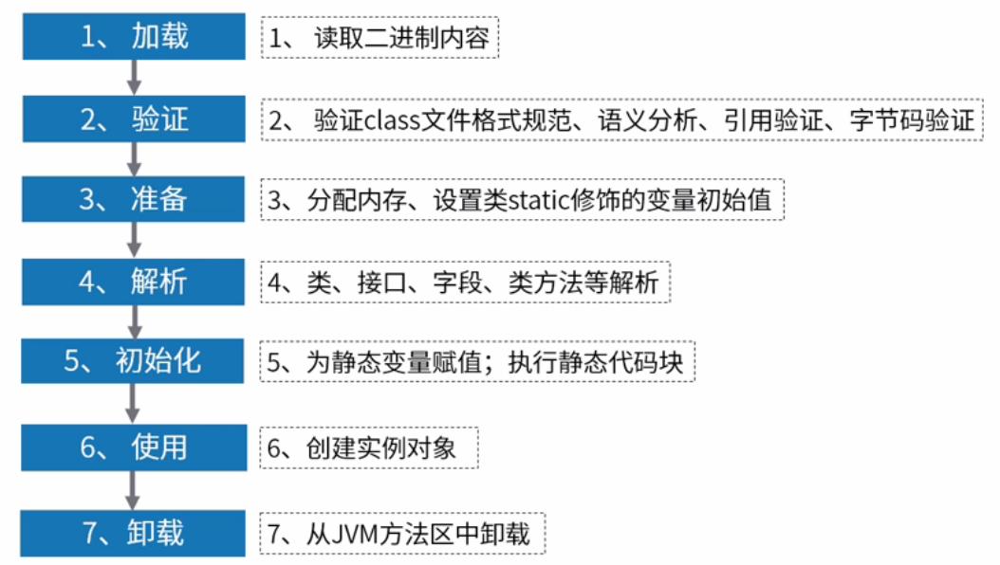

# 类的生命周期



# 类的加载阶段
## 加载
 
1.根据类的全限定名称获取二进制字节流；

2.将二进制字节流所代表的静态存储结构转换为方法区运行时的数据结构；

3.在JAVA堆中创建一个代表这个类的`java.lang.Class`对象，作为访问方法区这些数据的入口； 

## 链接

### 验证

主要是为了安全考虑，为了确保`Class`文件的字节流中包含的信息符合当前虚拟机的要求，并且不会危害虚拟机自身的安全。
主要验证内容有：

> 验证文件格式：包括文件头部的魔术因子、class文件主次版本号、class文件的MD5指纹、变量类型是否支持等

> 元数据的验证：对class的字节流进行语义分析，判断是否符合JVM规范。简单来说就是java语法的正确性

> 字符码验证：主要验证程序的控制流程，如循环、分支等

> 符号引用验证：验证符号引用转换为直接引用时的合法性，保证解析动作的顺利执行。比如不能访问引用类的私有方法、全限定名称是否能找到相关的类。


### 准备

Java 中的变量有「类变量」和「类成员变量」两种类型，「类变量」指的是被 `static` 修饰的变量，而其他所有类型的变量都属于「类成员变量」。

在准备阶段，JVM 只会为「类变量」分配内存，并将其初始化为数据类型默认的零值（如`0、0L、null、false`等），而不是被在Java代码中被显式地赋予的值。

「类成员变量」会在对象实例化时随着对象一块分配在Java堆中。

下表列出了Java中所有基本数据类型以及reference类型的默认零值：

| 数据类型  | 默认零值 |
| --------- | -------- |
| int       | 0        |
| long      | 0L       |
| short     | (short)0 |
| char      | '\u0000' |
| byte      | (byte)0  |
| boolean   | false    |
| float     | 0.0f     |
| double    | 0.0d     |
| reference | null     |


> 如果一个变量是常量（被 `static final` 修饰）的话，那么在准备阶段，属性便会被赋予用户希望的值

> final 关键字在 Java 中代表不可改变的意思，意思就是值一旦赋值就不会在改变了。既然一旦赋值就不会再改变，那么就必须一开始就给其赋予用户想要的值，因此被 final 修饰的类变量在「准备阶段」就会被赋予想要的值。而没有被 final 修饰的类变量，其可能在初始化阶段或者运行阶段发生变化，所以就没有必要在准备阶段对它赋予用户想要的值，因而为默认值。

> 对于引用数据类型reference来说，如数组引用、对象引用等，如果没有对其进行显式地赋值而直接使用，系统都会为其赋予默认的零值，即null。

> 如果在数组初始化时没有对数组中的各元素赋值，那么其中的元素将根据对应的数据类型而被赋予默认的零值。

### 解析

> 虚拟机将常量池内的符号引用替换为直接引用的过程

> 符号引用（Symbolic References）：符号引用以一组符号来描述所引用的目标，符号可以是任何形式的字面量，只要使用时能无歧义的定位到目标即可。

> 直接引用（Direct References）：直接引用可以是直接指向目标的指针、相对偏移量或是一个能间接定位到目标的句柄。如果有了直接引用，那么引用的目标一定是已经存在于内存中。


## 初始化


为类的静态变量赋予正确的初始值

JVM负责对类进行初始化，主要对类变量进行初始化。在Java中对类变量进行初始值设定有两种方式：

① 声明类变量是指定初始值；

② 使用静态代码块为类变量指定初始值；

 

③ JVM初始化步骤

 1)、假如这个类还没有被加载和链接，则程序先加载并链接该类

 2)、假如该类的直接父类还没有被初始化，则先初始化其直接父类

 3)、假如类中有初始化语句，则系统依次执行这些初始化语句

 

④ 类初始化时机：只有当对类的主动使用的时候才会导致类的初始化，类的主动使用（类的主动引用）包括以下六种：

– 创建类的实例，也就是new的方式

```java
class Demo {
	static {  
		System.out.println("进行初始化");
	}
}
 
public class Test {
	public static void main(String[] args) {
		Demo demo = new Demo();
	}
}
```
– 访问某个类或接口的静态变量，或者对该静态变量赋值
```java
public class Demo {
    static {
        System.out.println("进行初始化");
    }
    //访问简单静态变量x，会导致Demo类的初始化。
    public static int x = 10;
}
public class Test {
	public static void main(String[] args) {
		System.out.println(Demo.x);
	}
}
```
– 调用类的静态方法
```java
public class Demo {
    static {
        System.out.println("进行初始化");
    }
    //在其他类中调用静态方法test，会导致Demo类的初始化。
    public static void test() {
    }
}
 
public class Test {
	public static void main(String[] args) {
		System.out.println(Demo.test());
	}
}
```
– 反射（如Class.forName(“com.Demo”)）
```java
public static void main(String[] args) throws ClassNotFoundException {
        //通过反射导致Demo类初始化
        Class.forName("com.Demo");
}
```
– 初始化某个类的子类，则其父类也会被初始化
```java
class Super {
	public static int m = 11;
	static {
		System.out.println("执行了super类静态语句块");
	}
}

class Father extends Super {
	public static int m = 33;
	static {
		System.out.println("执行了父类静态语句块");
	}
}

class Child extends Father {
	static {
		System.out.println("执行了子类静态语句块");
	}
	
}

public class Test {
	public static void main(String[] args) {
		System.out.println(Child.m);
	}
}
```
运行结果输出：

```
执行了super类静态语句块
执行了父类静态语句块
33
```
> 注意：通过子类使用父类的静态变量只会导致父类的初始化，子类不会初始化。 

– 当虚拟机启动时，用户需要指定一个要执行的主类，虚拟机会先初始化这个主类。（其实就是public static void main（String[] args）所在的那个类）

### 被动引用：

1.通过子类引用父类的静态字段，不会导致子类初始化

下面这个例子中，虽然是以Son.count 形式调用的，但是因为count是Father的静态成员变量，所以只初始化Father类，而不初始化Son类

```java
 
class Father {
	static int count = 1;
	static {
		System.out.println("Initialize class Father");
	}
}
 
class Son extends Father {
	static{
		System.out.println("Initialize class Son");
	}
}
 
public class Test {
	public static void main(String[] args) {
		int x = Son.count;
	}
}
```

2.通过数组定义类引用类，不会触发此类的初始化

```java
 
class Demo {
	static {
		System.out.println("Initialize class Demo");
	}
}
 
public class Test {
	public static void main(String[] args) {
		Demo[] demos = new Demo[10];
	}
}
```
但是没有输出

 
3.常量在编译阶段会存入调用类的常量池中，本质上没有直接引用到定义常量的类，因此不会触发定义常量的类的初始化
```java
 
class Demo {
	static final int count = 1;
	static {
		System.out.println("Initialize class Demo");
	}
}
 
public class Test {
	public static void main(String[] args) {
		int x = Demo.count;
	}
}
```
如上例中，Demo类中定义的count是final对象，其在编译阶段就会存入调用类的常量池中

> 垃圾回收统计

`jstat -gc 12345`

字段说明：

|S0C	|S1C	|S0U|	S1U|	EC|	EU|	OC	|OU	|MC	|MU	|CCSC|	CCSU|	YGC|	YGCT|	FGC|	FGCT	|GCT|
| --------- | -------- | -------- | -------- | -------- | -------- | -------- | -------- | -------- | -------- | -------- | -------- | -------- | -------- | -------- | -------- | -------- | 
|第一个幸存区的空间大小	|第二个幸存区的空间大小|	第一个幸存区的使用大小|	第二个幸存区的使用大小|	伊甸园区的空间大小	|伊甸园区的使用大小|	老年代空间大小|	老年代使用大小	|方法区（元空间）空间大小|	方法区使用大小	|压缩类空间大小	|压缩类空间使用大小|	年轻代垃圾回收次数	|年轻代垃圾回收消耗时间	|老年代垃圾回收次数|	老年代垃圾回收消耗时间	|垃圾回收消|耗总时间|


样例：

 |S0C  |  S1C  |  S0U  |  S1U   |   EC   |    EU   |     OC   |      OU    |   MC   |  MU  |  CCSC  | CCSU  | YGC   |  YGCT |   FGC |   FGCT   |  GCT|
| --------- | -------- | -------- | -------- | -------- | -------- | -------- | -------- | -------- | -------- | -------- | -------- | -------- | -------- | -------- | -------- | -------- | 
|43008.0| 44544.0 | 0.0  | 20811.5| 923136.0| 554117.1 | 453120.0 |  45926.1  | 75160.0 |73713.5 |9384.0 |9023.6  |   13 |   0.182 |  3  |    0.288  |  0.470 |
