# CAS

## 线程安全

线程安全主要体现在以下三个方面：

- 原子性：提供了互斥访问，同一时刻只能有一个线程对它进行操作

- 可见性：一个线程对主内存的修改可以及时的被其他线程观察到

- 有序性：一个线程观察其他线程中的指令执行顺序，由于指令重排序的存在，该观察结果一般杂乱无序


## 首先什么是原子操作？

原子本意是“不能被进一步分割的最小粒子”，而原子操作意为”不可被中断的一个或一系列操作”；

## 处理器如何实现原子操作？

- 首先处理器会自动保证基本的内存操作的原子性：处理器保证从系统内存当中读取或者写入一个字节是原子的，意思是当一个处理器读取一个字节时，其他处理器不能访问这个字节的内存地址。


- 总线锁保证原子性：所谓总线锁就是使用处理器提供的一个LOCK＃信号，当一个处理器在总线上输出此信号时，其他处理器的请求将被阻塞住,那么该处理器可以独占使用共享内存。

- 缓存锁定保证原子性：锁住总线的消耗太大，于是有了缓存锁，在Lock期间处理器缓存的内存区域会被锁定，其他处理其无法更改该块内存中的数据。具体的cache一致性可以看多核处理器cache一致性技术

以上两个机制我们可以通过Inter处理器提供了很多LOCK前缀的指令来实现。比如位测试和修改指令BTS，BTR，BTC，交换指令XADD，CMPXCHG和其他一些操作数和逻辑指令，比如ADD（加），OR（或）等，被这些指令操作的内存区域就会加锁，导致其他处理器不能同时访问它。


## JAVA如何实现原子操作？

JAVA使用 **锁** 和 **循环CAS**

先说说悲观锁与乐观锁：

- 悲观锁: 假定会发生并发冲突，即共享资源会被某个线程更改。所以当某个线程获取共享资源时，会阻止别的线程获取共享资源。也称独占锁或者互斥锁，例如java中的`synchronized`同步锁。

- 乐观锁: 假设不会发生并发冲突,只有在最后更新共享资源的时候会判断一下在此期间有没有别的线程修改了这个共享资源。如果发生冲突就重试，直到没有冲突，更新成功。CAS就是一种乐观锁实现方式。

悲观锁会阻塞其他线程。乐观锁不会阻塞其他线程，如果发生冲突，采用死循环的方式一直重试，直到更新成功。

`synchronized`同步锁会让没有得到锁资源的线程进入`BLOCKED`状态，而后在争夺到锁资源后恢复为`RUNNABLE`状态，这个过程中涉及到操作系统用户模式和内核模式的转换，代价比较高。

尽管JAVA 1.6为`synchronized`做了优化，增加了从偏向锁到轻量级锁再到重量级锁的过度，但是在最终转变为重量级锁之后，性能仍然比较低。所以面对这种情况，我们就可以使用java中的“原子操作类”。

所谓原子操作类，指的是`java.util.concurrent.atomic`包下，一系列以Atomic开头的包装类。如AtomicBoolean，AtomicUInteger，AtomicLong。它们分别用于Boolean，Integer，Long类型的原子性操作。而Atomic操作类的底层正是用到了“CAS机制”。

Atomic包中提供了很多的类：

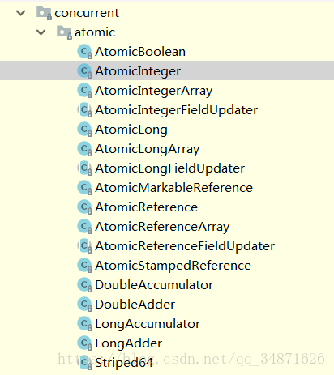

它们都是CAS（compareAndSwap）来实现原子性。

## 什么是CAS？

> CAS:Compare and Swap, 翻译成比较并交换。

看到这个定义，可以说是没有任何意义的一句话，但是确实最能概括CAS操作过程的一句话。

> CAS 操作包含三个操作数 —— 内存位置（V）、预期原值（A）和新值(B)。 如果内存位置的值与预期原值相匹配，那么处理器会自动将该位置值更新为新值 。否则，处理器不做任何操作

我们看一个例子：

1. 在内存地址V当中，存储着值为10的变量。

    

2. 此时线程1想把变量的值增加1.对线程1来说，旧的预期值A=10，要修改的新值B=11.

    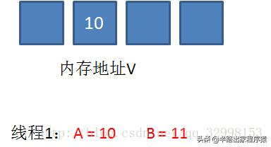

3. 在线程1要提交更新之前，另一个线程2抢先一步，把内存地址V中的变量值率先更新成了11。

    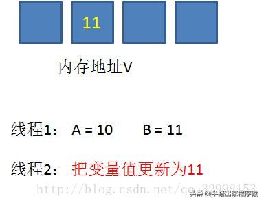

4. 线程1开始提交更新，首先进行A和地址V的实际值比较，发现A不等于V的实际值，提交失败。

    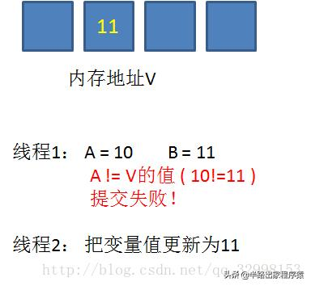

5. 线程1 重新获取内存地址V的当前值，并重新计算想要修改的值。此时对线程1来说，A=11，B=12。这个重新尝试的过程被称为自旋。

    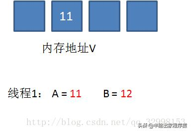

6. 这一次比较幸运，没有其他线程改变地址V的值。线程1进行比较，发现A和地址V的实际值是相等的。

    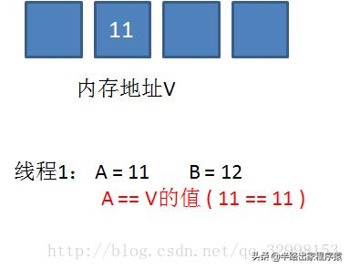

7. 线程1进行交换，把地址V的值替换为B，也就是12.

    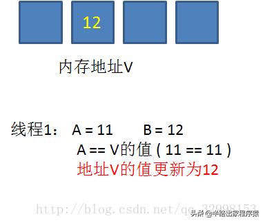

从思想上来说，`synchronized`属于悲观锁，悲观的认为程序中的并发情况严重，所以严防死守，CAS属于乐观锁，乐观地认为程序中的并发情况不那么严重，所以让线程不断去重试更新。


## CAS的缺点：

- CPU开销过大

    在并发量比较高的情况下，如果许多线程反复尝试更新某一个变量，却又一直更新不成功，循环往复，会给CPU带来很到的压力。

- 不能保证代码块的原子性

    CAS机制所保证的知识一个变量的原子性操作，而不能保证整个代码块的原子性。比如需要保证3个变量共同进行原子性的更新，就不得不使用synchronized了。

- ABA问题
   
    这是CAS机制最大的问题所在。（后面有介绍）

## JAVA中CAS的底层实现    

我们看一下AtomicInteger当中常用的自增方法incrementAndGet：
```java
public final int incrementAndGet() {
    for (;;) {
        int current = get();
        int next = current + 1;
        if (compareAndSet(current, next))
            return next;
    }
}

private volatile int value;
public final int get() {
    return value;
}
```
这段代码是一个无限循环，也就是CAS的自旋，循环体中做了三件事：

1. 获取当前值

2. 当前值+1，计算出目标值

3. 进行CAS操作，如果成功则跳出循环，如果失败则重复上述步骤

这里需要注意的重点是get方法，这个方法的作用是获取变量的当前值。

> 注：volatile 关键字保证了变量的可见性，根据JAVA内存模型，每一个线程都有自己的栈内存，不同线程的栈内存里的变量有可能因为栈内的操作而不同，而 CPU又是直接操作栈中的数据并保存在自己的缓存中，所以多核CPU就出现了很大的问题，而volatile修饰的变量，保证了CPU各个核心不会从栈内存中 和 缓存中读数据，而是直接从堆内存中读数据，而且写操作会直接写回堆内存中，从而保证了多线程间共享变量的可见性和局部顺序性（但不保证原子性）


如何保证获取的当前值是内存中的最新值？很简单，用volatile关键字来保证（保证线程间的可见性）。我们接下来看一下compareAndSet方法的实现：

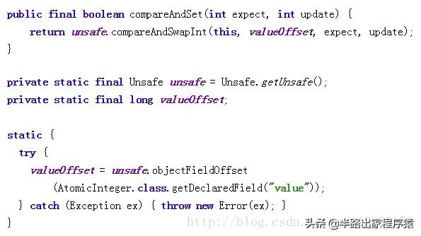

`compareAndSet`方法的实现很简单，只有一行代码。这里涉及到两个重要的对象，一个是`unsafe`，一个是`valueOffset`。

什么是`unsafe`呢？Java语言不像C，C++那样可以直接访问底层操作系统，但是JVM为我们提供了一个后门，这个后门就是`unsafe`。`unsafe`为我们提供了硬件级别的原子操作。

至于`valueOffset`对象，是通过`unsafe.objectFiledOffset`方法得到，所代表的是AtomicInteger对象value成员变量在内存中的偏移量。我们可以简单的把valueOffset理解为value变量的内存地址。

我们上面说过，CAS机制中使用了3个基本操作数：内存地址V，旧的预期值A，要修改的新值B。

而`unsafe`的`compareAndSwapInt`方法的参数包括了这三个基本元素：`valueOffset`参数代表了`V`，`expect`参数代表了`A`，update参数代表了`B`。

正是`unsafe`的`compareAndSwapInt`方法保证了`Compare`和`Swap`操作之间的原子性操作。

### compareAndSwapInt具体实现

以`Unsafe`类的`compareAndSwapInt()`方法为例来说，`compareAndSwapInt`就是借助C语言和汇编代码来实现的。

下面从分析比较常用的`CPU（intel x86）`来解释`CAS`的实现原理。

下面是`JDK`中`sun.misc.Unsafe`类的`compareAndSwapInt()`方法的源代码：
```java
// native方法，是没有其Java代码实现的，而是需要依靠JDK和JVM的实现
public final native boolean compareAndSwapInt(Object o, long offset,
                                              int expected,
                                              int x);
```
可以看到这是个本地方法。这个本地方法在openjdk中依次调用的c++代码为：unsafe.cpp，atomic.cpp和atomicwindowsx86.inline.hpp。

这个本地方法的最终实现在openjdk的如下位置：openjdk-7-fcs-src-b147-27jun2011\openjdk\hotspot\src\oscpu\windowsx86\vm\ atomicwindowsx86.inline.hpp（对应于windows操作系统，X86指令集）。

下面是对应于intel x86处理器的源代码的片段：
```java
// Adding a lock prefix to an instruction on MP machine
// VC++ doesn't like the lock prefix to be on a single line
// so we can't insert a label after the lock prefix.
// By emitting a lock prefix, we can define a label after it.
#define LOCK_IF_MP(mp) __asm cmp mp, 0  \
                       __asm je L0      \
                       __asm _emit 0xF0 \
                       __asm L0:

inline jint Atomic::cmpxchg (jint exchange_value, volatile jint* dest, jint compare_value) 
{
  // alternative for InterlockedCompareExchange
  int mp = os::is_MP();
  __asm {
    mov edx, dest
    mov ecx, exchange_value
    mov eax, compare_value
    LOCK_IF_MP(mp)               // 这里需要先进行判断是否为多核处理器
    cmpxchg dword ptr [edx], ecx // 如果是多核处理器就会在这行指令前加Lock标记
  }
}
```
```java
int mp = os::is_MP();   
```
`os::is_MP()`会返回当前JVM运行所在机器是否为多核CPU，当然返回1代表true，0代表false

然后是一段内嵌汇编，C/C++支持内嵌汇编，大家知道这个特性就好，我来通俗易懂的解释一下这段汇编的大体意思。
```C#
__asm {
mov edx, dest             # 取Atomic::cmpxchg方法的参数dest内存地址存入寄存器edx
mov ecx, exchange_value   # 取Atomic::cmpxchg方法的参数exchange_value内存地址存入寄存器ecx
mov eax, compare_value    # 取Atomic::cmpxchg方法的参数compare_value内存地存入寄存器eax
LOCK_IF_MP(mp)            # 如果是多核处理器，就在下一行汇编代码前加上lock前缀
cmpxchg dword ptr [edx], ecx # 比较ecx和eax的中内存地址的中存的变量值，如果相等就写入edx内存地址中，否则不
}
```
x86汇编指令`cmpxchg`本身保证了原子性，其实就是cpu的CAS操作的实现，那么问题来了，为什么保证了原子性还需要在多核处理器中加上lock前缀呢？

答案是：多核处理器中不能保证可见性，`lock`前缀可以保证这行汇编中所有值的可见性，这个问题的原因是多核CPU中缓存导致的（x86中罪魁祸首是store buffer的存在）。

这样通过`lock`前缀保障多核处理器的可见性，然后通过cmpxchg指令完成CPU上原子性的CAS操作，完美解决问题！

## ABA问题

假设内存中有一个值为A的变量，存储在地址V中。


此时有三个线程想使用CAS的方式更新这个变量的值，每个线程的执行时间有略微偏差。线程1和线程2已经获取当前值，线程3还未获取当前值。

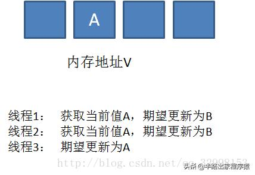

接下来，线程1先一步执行成功，把当前值成功从A更新为B；同时线程2因为某种原因被阻塞住，没有做更新操作；线程3在线程1更新之后，获取了当前值B。

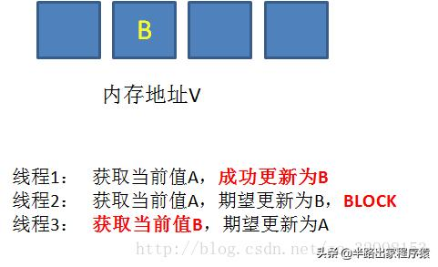

在之后，线程2仍然处于阻塞状态，线程3继续执行，成功把当前值从B更新成了A。

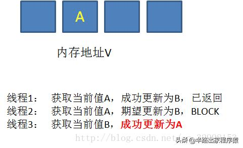

最后，线程2终于恢复了运行状态，由于阻塞之前已经获得了“当前值A”，并且经过compare检测，内存地址V中的实际值也是A，所以成功把变量值A更新成了B。

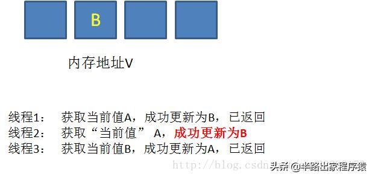

看起来这个例子没啥问题，但如果结合实际，就可以发现它的问题所在。

我们假设一个提款机的例子。假设有一个遵循CAS原理的提款机，小灰有100元存款，要用这个提款机来提款50元。


由于提款机硬件出了点问题，小灰的提款操作被同时提交了两次，开启了两个线程，两个线程都是获取当前值100元，要更新成50元。

理想情况下，应该一个线程更新成功，一个线程更新失败，小灰的存款值被扣一次。

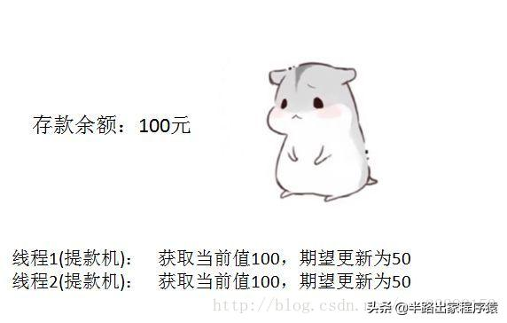

线程1首先执行成功，把余额从100改成50.线程2因为某种原因阻塞。这时，小灰的妈妈刚好给小灰汇款50元。

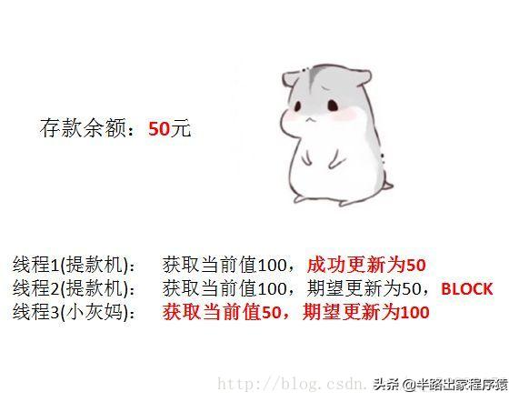

线程2仍然是阻塞状态，线程3执行成功，把余额从50改成了100。

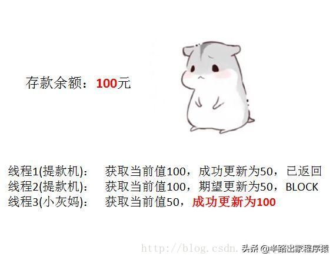

线程2恢复运行，由于阻塞之前获得了“当前值”100，并且经过compare检测，此时存款实际值也是100，所以会成功把变量值100更新成50。

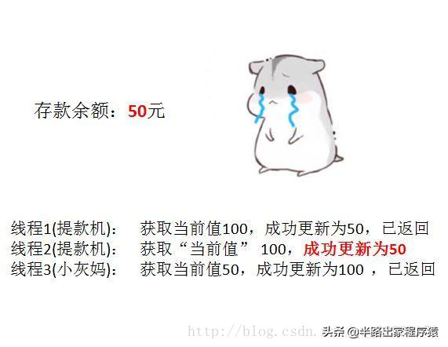


原本线程2应当提交失败，小灰的正确余额应该保持100元，结果由于ABA问题提交成功了。

怎么解决呢？加个版本号就可以了。

真正要做到严谨的CAS机制，我们在compare阶段不仅要比较期望值A和地址V中的实际值，还要比较变量的版本号是否一致。

我们仍然以刚才的例子来说明，假设地址V中存储着变量值A，当前版本号是01。线程1获取了当前值A和版本号01，想要更新为B，但是被阻塞了。

这时候，内存地址V中变量发生了多次改变，版本号提升为03，但是变量值仍然是A。

随后线程1恢复运行，进行compare操作。经过比较，线程1所获得的值和地址的实际值都是A，但是版本号不相等，所以这一次更新失败。

在Java中，AtomicStampedReference类就实现了用版本号作比较额CAS机制。

## JAVA中ABA中解决方案(AtomicStampedReference)

AtomicStampedReference主要维护包含一个对象引用以及一个可以自动更新的整数"stamp"的pair对象来解决ABA问题。

```java
//关键代码
public class AtomicStampedReference<V> {
    private static class Pair<T> {
        final T reference;  //维护对象引用
        final int stamp;  //用于标志版本
        private Pair(T reference, int stamp) {
            this.reference = reference;
            this.stamp = stamp;
        }
        static <T> Pair<T> of(T reference, int stamp) {
            return new Pair<T>(reference, stamp);
        }
    }
    private volatile Pair<V> pair;
    ....
    /**
      * expectedReference ：更新之前的原始值
      * newReference : 将要更新的新值
      * expectedStamp : 期待更新的标志版本
      * newStamp : 将要更新的标志版本
      */
    public boolean compareAndSet(V   expectedReference,
                                 V   newReference,
                                 int expectedStamp,
                                 int newStamp) {
        Pair<V> current = pair; //获取当前pair
        return
            expectedReference == current.reference && //原始值等于当前pair的值引用，说明值未变化
            expectedStamp == current.stamp && // 原始标记版本等于当前pair的标记版本，说明标记未变化
            ((newReference == current.reference &&
              newStamp == current.stamp) || // 将要更新的值和标记都没有变化
             casPair(current, Pair.of(newReference, newStamp))); // cas 更新pair
    }
}  
```  
使用示例

```java
import java.util.concurrent.atomic.AtomicStampedReference;
public class Test {
	private static AtomicStampedReference<Integer> atomicStampedRef = new AtomicStampedReference<>(1, 0);

	public static void main(String[] args) {
		Thread main = new Thread(() -> {
			System.out.println(Thread.currentThread().getName() + " 初始值 a = " + atomicStampedRef.getReference());
			int stamp = atomicStampedRef.getStamp(); // 获取当前标识别
			try {
				Thread.sleep(5000); // 等待1秒 ，以便让干扰线程执行
			} catch (InterruptedException e) {
				e.printStackTrace();
			}
			
			boolean isCASSuccess = atomicStampedRef.compareAndSet(1, 2, stamp, stamp + 1); // 此时expectedReference未发生改变，但是stamp已经被修改了,所以CAS失败
			System.out.println(Thread.currentThread().getName() + " CAS操作结果: " + isCASSuccess);
		}, "主操作线程");

		Thread other = new Thread(() -> {
			Thread.yield(); // 确保thread-main 优先执行
			
			atomicStampedRef.compareAndSet(1, 2, atomicStampedRef.getStamp(), atomicStampedRef.getStamp() + 1);
			System.out.println(Thread.currentThread().getName() + " 【increment】 ,值 = " + atomicStampedRef.getReference());
			
			atomicStampedRef.compareAndSet(2, 1, atomicStampedRef.getStamp(), atomicStampedRef.getStamp() + 1);
			System.out.println(Thread.currentThread().getName() + " 【decrement】 ,值 = " + atomicStampedRef.getReference());
		}, "干扰线程");

		main.start();
		other.start();
	}
}

```

结果输出：
```
主操作线程 初始值 a = 1
干扰线程 【increment】 ,值 = 2
干扰线程 【decrement】 ,值 = 1
主操作线程 CAS操作结果: false

```


