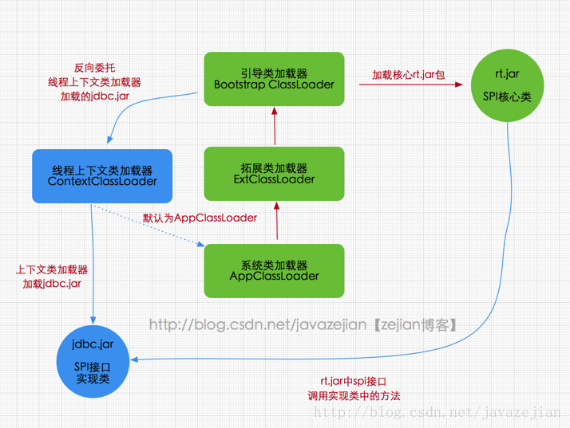
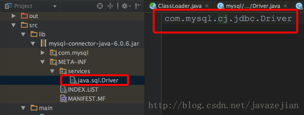

# ClassLoader
ClassLoad：类加载器（class loader）用来加载 Java 类到 Java 虚拟机中。Java 源程序（.java 文件）在经过 Java 编译器编译之后就被转换成 Java 字节代码（.class 文件）。类加载器负责读取 Java 字节代码，并转换成 java.lang.Class 类的一个实例。

# ClassLoader种类

虽说大家都是java类，但java类也是分三六九等的，不是同一阶级的java类自然不能使用同一种ClassLoader去加载，总的来说分为四类：

> 启动类加载器（Bootstrap ClassLoader)

启动类加载器主要加载的是JVM自身需要的类，这个类加载使用`C++`语言实现的，是虚拟机自身的一部分，它负责将 `<JAVA_HOME>/lib`路径下的核心类库或`-Xbootclasspath`参数指定的路径下的jar包加载到内存中，注意必由于虚拟机是按照文件名识别加载jar包的，如`rt.jar`，如果文件名不被虚拟机识别，即使把jar包丢到lib目录下也是没有作用的(出于安全考虑，Bootstrap启动类加载器`只加载包名为java、javax、sun等开头的类`)。


> 扩展类加载器（Extension ClassLoader)

扩展类加载器是指Sun公司(已被Oracle收购)实现的`sun.misc.Launcher$ExtClassLoader`类，由Java语言实现的，是Launcher的静态内部类，它负责加载`<JAVA_HOME>/lib/ext`目录下或者由系统变量`-Djava.ext.dir`指定位路径中的类库，开发者可以直接使用标准扩展类加载器。


> 应用程序类加载器（App ClassLoader）

也称应用程序加载器是指 Sun公司实现的`sun.misc.Launcher$AppClassLoader`。它负责加载系统类路径`java -classpath`或`-D java.class.path` 指定路径下的类库，也就是我们经常用到的`classpath`路径，开发者可以直接使用系统类加载器，一般情况下该类加载是程序中默认的类加载器，通过`ClassLoader.getSystemClassLoader()`方法可以获取到该类加载器。

> 自定义类加载器

有时候，应用程序类加载器不能满足我们的要求，会自己定义一些类加载器。但其实这应该也算一种应用程序类加载器。

```java
public class Test {
	public static void main(String[] args) {
		System.out.println(Test4.class.getClassLoader().getParent().getParent());
		System.out.println(Test4.class.getClassLoader().getParent());
		System.out.println(Test4.class.getClassLoader());
	}
}
```
输出结果：
```
null
sun.misc.Launcher$ExtClassLoader@33909752
sun.misc.Launcher$AppClassLoader@4e25154f
```

## 双亲委派机制

当AppClassLoader加载一个class时，它首先不会自己去尝试加载这个类，而是把类加载请求委派给父类加载器ExtClassLoader去完成。
当ExtClassLoader加载一个class时，它首先也不会自己去尝试加载这个类，而是把类加载请求委派给BootStrapClassLoader去完成。
如果BootStrapClassLoader加载失败（例如在$JAVA_HOME/jre/lib里未查找到该class），会使用ExtClassLoader来尝试加载；
若ExtClassLoader也加载失败，则会使用AppClassLoader来加载，如果AppClassLoader也加载失败，则会报出异常ClassNotFoundException。

ClassLoader类源码解析

- loadClass(String)
  
  该方法加载指定名称（包括包名）的二进制类型，该方法在JDK1.2之后不再建议用户重写但用户可以直接调用该方法，loadClass()方法是ClassLoader类自己实现的，该方法中的逻辑就是双亲委派模式的实现，`loadClass(String name, boolean resolve)`是一个重载方法，`resolve参数代表是否生成class对象的同时进行解析相关操作`。

    ```java
    protected Class<?> loadClass(String name, boolean resolve)
        throws ClassNotFoundException {

        synchronized (getClassLoadingLock(name)) {
            // First, check if the class has already been loaded
            //首先检查这个类是否被加载过，如果已经被加载过，就不需要加载了
            Class<?> c = findLoadedClass(name);
            if (c == null) {
                long t0 = System.nanoTime();
                try {
                    if (parent != null) {
                        //如果有父级类加载器则由父级加载器先加载
                        c = parent.loadClass(name, false);
                    } else {
                        //没有父级加载器则有启动类加载器加载
                        c = findBootstrapClassOrNull(name);
                    }
                } catch (ClassNotFoundException e) {
                    // ClassNotFoundException thrown if class not found
                    // from the non-null parent class loader
                }

                if (c == null) {
                    // If still not found, then invoke findClass in order
                    // to find the class.
                    //父级加载器无法加载则自己加载，核心就是findClass方法
                    long t1 = System.nanoTime();
                    c = findClass(name);

                    // this is the defining class loader; record the stats
                    sun.misc.PerfCounter.getParentDelegationTime().addTime(t1 - t0);
                    sun.misc.PerfCounter.getFindClassTime().addElapsedTimeFrom(t1);
                    sun.misc.PerfCounter.getFindClasses().increment();
                }
            }
            if (resolve) {
                resolveClass(c);
            }
            return c;
        }
    }
    ```

    正如loadClass方法所展示的，当类加载请求到来时，先从缓存中查找该类对象，如果存在直接返回，如果不存在则交给该类加载去的父加载器去加载，倘若没有父加载则交给顶级启动类加载器去加载，最后倘若仍没有找到，则使用findClass()方法去加载（关于findClass()稍后会进一步介绍）。从loadClass实现也可以知道如果不想重新定义加载类的规则，也没有复杂的逻辑，只想在运行时加载自己指定的类，那么我们可以直接使用`ClassLoader.getSystemClassLoader().loadClass("className")`，这样就可以直接调用ClassLoader的loadClass方法获取到class对象。

- findClass(String)

    在JDK1.2之前，在自定义类加载时，总会去继承ClassLoader类并重写loadClass方法，从而实现自定义的类加载类，但是在JDK1.2之后已不再建议用户去覆盖loadClass()方法，而是建议把自定义的类加载逻辑写在findClass()方法中，从前面的分析可知，findClass()方法是在loadClass()方法中被调用的，当loadClass()方法中父加载器加载失败后，则会调用自己的findClass()方法来完成类加载，这样就可以保证自定义的类加载器也符合双亲委托模式。需要注意的是`ClassLoader类中并没有实现findClass()方法的具体代码逻辑，取而代之的是抛出ClassNotFoundException异常`，同时应该知道的是findClass方法通常是和defineClass方法一起使用的(稍后会分析)，ClassLoader类中findClass()方法源码如下：
    ```java
    //直接抛出异常
    protected Class<?> findClass(String name) throws ClassNotFoundException {
            throw new ClassNotFoundException(name);
    }
    ```
- defineClass(byte[] b, int off, int len)
  
    defineClass()方法是`用来将byte字节流解析成JVM能够识别的Class对象`(ClassLoader中已实现该方法逻辑)，通过这个方法不仅能够通过class文件实例化class对象，也可以通过其他方式实例化class对象，如通过网络接收一个类的字节码，然后转换为byte字节流创建对应的Class对象，defineClass()方法通常与findClass()方法一起使用，一般情况下，在自定义类加载器时，会直接覆盖ClassLoader的findClass()方法并编写加载规则，取得要加载类的字节码后转换成流，然后调用defineClass()方法生成类的Class对象，简单例子如下：
    ```java
    protected Class<?> findClass(String name) throws ClassNotFoundException {
        // 获取类的字节数组
        byte[] classData = getClassData(name);  
        if (classData == null) {
            throw new ClassNotFoundException();
        } else {
            //使用defineClass生成class对象
            return defineClass(name, classData, 0, classData.length);
        }
    }
    ```
    需要注意的是，如果`直接调用defineClass()方法生成类的Class对象，这个类的Class对象并没有解析`(也可以理解为链接阶段，毕竟解析是链接的最后一步)，其解析操作需要等待后续使用Class进行类实例化时（`clazz.newInstance();`）进行 或 调用`resolveClass(clazz)`主动进行解析（可参照loadClass源码）。

- resolveClass(Class≺?≻ c)

    使用该方法可以使用类的Class对象创建完成也同时被解析。前面我们说链接阶段主要是对字节码进行验证，为类变量分配内存并设置初始值同时将字节码文件中的符号引用转换为直接引用。


> 作用：双亲委派是为了安全而设计的，假如我们自定义了一个java.lang.Integer类如下，当使用它时，因为双亲委派，会先使用BootStrapClassLoader来进行加载，这样加载的便是jdk的Integer类，而不是自定义的这个，避免因为加载自定义核心类而造成JVM运行错误。

```java
package java.lang;

public class Integer {
    public Integer(int value) {
        System.exit(0);
    }
}
```
初始化这个Integer的构造器是会退出JVM，破坏应用程序的正常进行，如果使用双亲委派机制的话该Integer类永远不会被调用，以为委托BootStrapClassLoader加载后会加载JDK中的Integer类而不会加载自定义的这个，可以看下下面这测试个用例：
```java
public static void main(String[] args) {
        Integer i = new Integer(1);
        System.err.println(i);
}
```
执行时JVM并未在new Integer(1)时退出，说明未使用自定义的Integer，于是就保证了安全性。


##  class文件的加载的时机

### 1、加载类型

> 显示加载：

调用ClassLoader.loadClass(className)与Class.forName(className)

> 隐式加载：

创建类对象

使用类的静态域

创建子类对象

使用子类的静态域

> 注意其实还有其他特殊的隐式加载：

在JVM启动时，BootStrapLoader会加载一些JVM自身运行所需的class

在JVM启动时，ExtClassLoader会加载指定目录下一些特殊的class

在JVM启动时，AppClassLoader会加载classpath路径下的class，以及main函数所在的类的class文件。

 

### 2、 两种显示加载class文件到JVM的区别

> Class.forName(className)加载class后并初始化

`Class.forName(className)`方法，内部实际调用的方法是 `Class.forName(className,true,classloader);`第2个boolean参数表示类是否需要初始化，`Class.forName(className)默认是需要初始化`。


> ClassLoader.loadClass(className)不会初始化

`ClassLoader.loadClass(className)`方法，内部实际调用的方法是 `ClassLoader.loadClass(className,false);`第2个 boolean参数，表示目标对象是否进行链接，false表示不进行链接，由上面介绍，不进行链接意味着不进行包括初始化等一些列步骤，那么静态块和静态对象就不会得到执行。

> Class.forName借助当前调用者的class的ClassLoader完成class的加载。

### 3、 class文件的隐式加载会执行static域 

### 4、 JVM默认的ClassLoader是AppClassLoader 

## 类不会重复加载
- 类的唯一性：同一个类加载器，类名一样，代表是同一个类。
- 识别方式: ClassLoader Instance id + PackageName + ClassName

## 类的卸载
卸载一个类，需要满足两个条件
- 该 Class 所有的实例都已经被 GC
- 加载该类的 ClassLoader 实例已经被 GC

## 双亲委派模型的破坏者-线程上下文类加载器

在Java应用中存在着很多服务提供者接口（Service Provider Interface，SPI），这些接口允许第三方为它们提供实现，如常见的 SPI 有 JDBC、JNDI等，这些 SPI 的接口属于 Java 核心库，一般存在rt.jar包中，由Bootstrap类加载器加载，而 SPI 的第三方实现代码则是作为Java应用所依赖的 jar 包被存放在classpath路径下，由于SPI接口中的代码经常需要加载具体的第三方实现类并调用其相关方法，但SPI的核心接口类是由Bootstrap类加载器来加载的，而Bootstrap类加载器无法直接加载SPI的实现类，同时由于双亲委派模式的存在，Bootstrap类加载器也无法反向委托AppClassLoader加载器SPI的实现类。在这种情况下，我们就需要一种特殊的类加载器来加载第三方的类库，而线程上下文类加载器就是很好的选择。
   

线程上下文类加载器（contextClassLoader）是从 JDK 1.2 开始引入的，我们可以通过`java.lang.Thread`类中的`getContextClassLoader()`和 `setContextClassLoader(ClassLoader cl)`方法来获取和设置线程的上下文类加载器。`如果没有手动设置上下文类加载器，线程将继承其父线程的上下文类加载器，初始线程的上下文类加载器是系统类加载器（AppClassLoader）`,在线程中运行的代码可以通过此类加载器来加载类和资源，如下图所示，以jdbc.jar加载为例



从图可知rt.jar核心包是有Bootstrap类加载器加载的，其内包含SPI核心接口类，由于SPI中的类经常需要调用外部实现类的方法，而jdbc.jar包含外部实现类(jdbc.jar存在于classpath路径)无法通过Bootstrap类加载器加载，因此只能委派线程上下文类加载器把jdbc.jar中的实现类加载到内存以便SPI相关类使用。显然这种线程上下文类加载器的加载方式破坏了“双亲委派模型”，它在执行过程中抛弃双亲委派加载链模式，使程序可以逆向使用类加载器，当然这也使得Java类加载器变得更加灵活。为了进一步证实这种场景，不妨看看DriverManager类的源码，DriverManager是Java核心rt.jar包中的类，该类用来管理不同数据库的实现驱动即Driver，它们都实现了Java核心包中的java.sql.Driver接口，如mysql驱动包中的com.mysql.jdbc.Driver，这里主要看看如何加载外部实现类，在DriverManager初始化时会执行如下代码
```java
//DriverManager是Java核心包rt.jar的类
public class DriverManager {
	//省略不必要的代码
    static {
        loadInitialDrivers();//执行该方法
        println("JDBC DriverManager initialized");
    }

    //loadInitialDrivers方法
    private static void loadInitialDrivers() {
        sun.misc.Providers()
        AccessController.doPrivileged(new PrivilegedAction<Void>() {
            public Void run() {
				//加载外部的Driver的实现类
                ServiceLoader<Driver> loadedDrivers = ServiceLoader.load(Driver.class);
                //省略不必要的代码......
            }
        });
    }
    //省略不必要的代码......
}   
```
在DriverManager类初始化时执行了loadInitialDrivers()方法,在该方法中通过`ServiceLoader.load(Driver.class);`去加载外部实现的驱动类，`ServiceLoader类会去读取mysql的jdbc.jar下META-INF文件的内容`，如下所示



而com.mysql.jdbc.Driver继承类如下：
```java
public class Driver extends com.mysql.cj.jdbc.Driver {
    public Driver() throws SQLException {
        super();
    }

    static {
        System.err.println("Loading class `com.mysql.jdbc.Driver'. This is deprecated. The new driver class is `com.mysql.cj.jdbc.Driver'. "
                + "The driver is automatically registered via the SPI and manual loading of the driver class is generally unnecessary.");
    }
}
```
从注释可以看出平常我们使用com.mysql.jdbc.Driver已被丢弃了，取而代之的是com.mysql.cj.jdbc.Driver，也就是说官方不再建议我们使用如下代码注册mysql驱动
```java
//不建议使用该方式注册驱动类
Class.forName("com.mysql.jdbc.Driver");
String url = "jdbc:mysql://localhost:3306/test_db?characterEncoding=UTF-8";
// 通过java库获取数据库连接
Connection conn = java.sql.DriverManager.getConnection(url, "root", "root@555");
      
```
而是直接去掉注册步骤，如下即可
```java
String url = "jdbc:mysql://localhost:3306/cm-storylocker?characterEncoding=UTF-8";
// 通过java库获取数据库连接
Connection conn = java.sql.DriverManager.getConnection(url, "root", "root@555");
      
```
这样ServiceLoader会帮助我们处理一切，并最终通过load()方法加载，看看load()方法实现
```java
public static <S> ServiceLoader<S> load(Class<S> service) {
	 //通过线程上下文类加载器加载
      ClassLoader cl = Thread.currentThread().getContextClassLoader();
      return ServiceLoader.load(service, cl);
  }
```
很明显了确实通过线程上下文类加载器加载的，实际上核心包的SPI类对外部实现类的加载都是基于线程上下文类加载器执行的，通过这种方式实现了Java核心代码内部去调用外部实现类。我们知道线程上下文类加载器默认情况下就是AppClassLoader，那为什么不直接通过getSystemClassLoader()获取类加载器来加载classpath路径下的类的呢？其实是可行的，但这种直接使用getSystemClassLoader()方法获取AppClassLoader加载类有一个缺点，那就是代码部署到不同服务时会出现问题，如把代码部署到Java Web应用服务或者EJB之类的服务将会出问题，因为这些服务使用的线程上下文类加载器并非AppClassLoader，而是Java Web应用服自家的类加载器，类加载器不同。，所以我们应用该少用getSystemClassLoader()。总之不同的服务使用的可能默认ClassLoader是不同的，但使用线程上下文类加载器总能获取到与当前程序执行相同的ClassLoader，从而避免不必要的问题。


